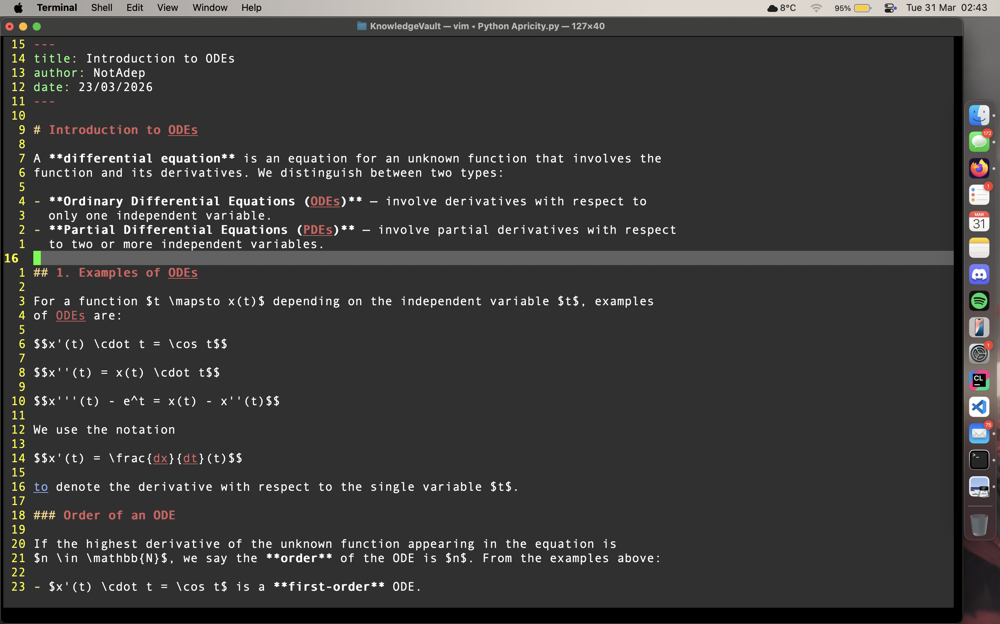

<h1>
  
  Apricity
</h1>

> *apricity (n.)* — the warmth of the sun in winter.

A private, offline, self-hosted knowledge system built around
**Vim + Markdown + Pandoc + LaTeX**. Apricity adds a browser viewer and a
terminal TUI on top of your existing plain-text workflow — without
changing anything about how you write.

> **Actively developed.** Apricity is a personal project in active development.
> Features are added regularly and feedback is very welcome.

---

## What it looks like

After running `python3 Apricity.py` in terminal, you will see the splash screen:


After loading, you arrive at the home page — your vault organised by subject:


Navigate with `j` and `k`. Selecting a note previews it instantly in the right panel:


Press `Enter` to open and edit the note in Vim:



Press `b` anywhere to open the browser viewer with full math rendering:


Link notes using `[[WikiLinks]]` and the graph view shows real connections:


---

## Two interfaces, one vault

- **Terminal TUI** — navigate, search, create, delete, and open notes
  without leaving the keyboard
- **Browser viewer** — read notes with full math rendering, a real graph
  view of connections, and live reload when you save in Vim

---

## Philosophy

- **Plain text forever** — every note is a `.md` file. No databases,
  no proprietary formats, no lock-in. Your notes will be readable in
  any text editor for the rest of your life
- **Your workflow, unchanged** — write in Vim, compile with Pandoc,
  view in the browser. Apricity wraps around what you already do
  rather than replacing it
- **Fully offline** — no cloud, no telemetry, no accounts. Everything
  runs on your own machine
- **Zero dependencies** — Python 3 stdlib only. No `pip install`,
  no virtual environments, no package managers

---

## Requirements

**Required:**
- macOS (tested on Apple M4). Linux and Windows support is planned
- Python 3 — already installed on every Mac
- [Pandoc](https://pandoc.org/installing.html) — download and run the `.pkg` installer

**Optional:**
- A text editor — [Vim](https://www.vim.org/) or [NeoVim](https://neovim.io/) recommended
- Any modern browser — Safari, Firefox, Chrome
- PDF export: [BasicTeX](https://www.tug.org/mactex/morepackages.html) —
  only needed if you want to export notes as PDF files. Apricity works
  fully without it. The setup script will offer to open the download
  page if you want it.

---

## Installation

### Step 1 — Download Apricity

**Option A — Direct download (no git required)**

[⬇ Download Apricity](https://github.com/NotAdep/Apricity/archive/refs/heads/main.zip)

Unzip the downloaded file. You will get a folder called `Apricity`.
Place it wherever you want your notes to live:

```
~/MyNotes/          ← your notes folder (name it anything)
  Apricity/         ← place the downloaded folder here
  Mathematics/      ← your subject folders will go here
  Physics/
```

**Option B — git clone**

```bash
mkdir ~/MyNotes
git clone https://github.com/NotAdep/Apricity.git ~/MyNotes/Apricity
```

### Step 2 — Run the setup script

```bash
cd ~/MyNotes/Apricity
python3 install.py
```

The script will:
- Create a starter subject folder with a welcome note
- Add Vim shortcuts to your `~/.vimrc` automatically (with your permission)
- Apricity checks for Pandoc and Vim itself at startup — it will tell
  you exactly what to install if anything is missing

### Step 3 — Start Apricity

```bash
python3 Apricity.py
```

Open `http://localhost:7777` in your browser. You are ready.

---

## Usage

### TUI controls

| Key | Action |
|-----|--------|
| `j` / `↓` | Move down |
| `k` / `↑` | Move up |
| `Enter` | Expand/collapse folder · Open note in Vim |
| `n` | New note in current subject (pre-fills frontmatter) |
| `N` | New subject folder |
| `d` | Delete note or folder — asks for confirmation |
| `o` | Open selected note in browser |
| `b` | Open full vault in browser |
| `l` | Link picker — jump to a linked note across any subject |
| `p` | Open a PDF linked in the current note |
| `t` | Tag picker — filter notes by tag |
| `Ctrl+D` | Scroll preview down |
| `Ctrl+U` | Scroll preview up |
| `/` | Full-text search across all note contents |
| `Esc` | Clear search or tag filter |
| `r` | Refresh vault |
| `q` | Quit and stop server |

### Vim shortcuts

The setup script adds these automatically. If you skipped it, add them
to `~/.vimrc` manually — replace `MyNotes` with your vault folder name:

```vim
let mapleader = ","
nnoremap <leader>c :w<CR>:!pandoc "%" -s --mathml --toc --embed-resources --standalone -c $HOME/MyNotes/Apricity/style.css --lua-filter=$HOME/MyNotes/Apricity/wikilinks.lua -o "%:r.html"<CR>
nnoremap <leader>p :w<CR>:!pandoc "%" --pdf-engine=xelatex -o "%:r.pdf"<CR>
```

- `,c` — compile note to HTML. Wikilinks resolved, browser auto-reloads
- `,p` — export note to PDF with fully rendered math

### Vault structure

```
[your vault]/              ← name this anything, put it anywhere
  Apricity/                ← system folder, excluded from TUI automatically
    Apricity.py
    vault.py
    install.py
    notes-viewer.html
    style.css
    wikilinks.lua
  Mathematics/             ← your subject folders
    Calculus.md
    Calculus.html
  Journal/
    2026-04-02.md
```

### Writing notes

Every note starts with YAML frontmatter:

```markdown
---
title: Lagrange Interpolation
author: Your Name
date: 02/04/2026
tags: [numerical-methods, interpolation]
---

# Lagrange Interpolation

Use $inline math$ and display math:

$$L_i(x) = \prod_{j=0, j \neq i}^{n} \frac{x - x_j}{x_i - x_j}$$

Link to any note: [[Newton's Laws]]

Link with custom text: [[Newton's Laws|see also]]

Attach a PDF: [Lecture Slides](slides.pdf)
```

Tags are optional — notes without tags work exactly as before.
Compile with `,c`. Wikilinks resolve and the browser reloads.

---

## Features

- **Wikilinks** — `[[Note Title]]` links any note from any subject
- **Tags** — add `tags: [tag1, tag2]` to frontmatter. Filter with `t`
  in TUI or click tag pills in the browser
- **Real graph view** — shows actual connections from wikilinks
- **Full-text search** — searches inside every `.md` file
- **Auto-reload** — browser updates the moment you press `,c`
- **Cross-subject navigation** — `l` jumps to linked notes anywhere
- **PDF support** — open linked PDFs with `p`, or click in browser
- **PDF export** — self-contained PDF with rendered math via `,p`
- **New note** — `n` opens Vim with frontmatter pre-filled
- **New folder** — `N` creates a new subject folder
- **Collapsible folders** — keep the TUI clean as your vault grows
- **UK date format** — DD/MM/YYYY from YAML frontmatter
- **Portable** — put your vault anywhere, name it anything
- **Server lifecycle** — one command starts everything, `q` stops everything

---

## Customisation

All styling lives in `style.css`. The colour scheme is Dracula-inspired
with Charter as the body font — both are system fonts on macOS.

The server runs on port `7777` by default. To change it, edit `vault.py`:

```python
PORT = 7777
```

---

## Terminal Profile

To match the terminal appearance shown in the screenshots, an
`Apricity.terminal` profile is included in the `Apricity/` folder.

To install it on macOS:
1. Open **Terminal** → **Settings** → **Profiles**
2. Click the gear icon → **Import...**
3. Navigate to `Apricity/Apricity.terminal` and open it
4. Set it as default if you wish

This is optional — Apricity works with any terminal.

---

## Vim basics

New to Vim? Here is everything you need to know to use Apricity:

| Action | Key |
|--------|-----|
| Start typing | `i` |
| Stop typing | `Esc` |
| Compile note to HTML | `,c` (in normal mode) |
| Save and close | `:wq` then `Enter` |
| Close without saving | `:q!` then `Enter` |

For a full interactive tutorial, type `vimtutor` in your terminal
and follow along — it takes about 30 minutes and covers everything.

---

## Roadmap

Apricity is actively being developed. Planned for upcoming versions:

- **Linux and Windows support**
- **Backlinks** — see which notes link to the current one
- **Password protection** — lock individual notes or folders
- **Export subject as PDF** — compile an entire subject into one document
- **Tauri app** — a proper native `.app` for macOS with one-click install

---

## Feedback and Contributing

Feedback, bug reports, and ideas are very welcome.

- **Found a bug?** Open an [Issue](https://github.com/NotAdep/Apricity/issues)
- **Have an idea?** Open an [Issue](https://github.com/NotAdep/Apricity/issues)
  and label it as a feature request
- **Want to contribute?** Fork the repo, make your changes, and open a
  Pull Request. There are no strict contribution guidelines yet — just
  keep the zero-dependency philosophy in mind

This is a solo project built for real academic use. If you are a student,
researcher, or anyone who takes notes seriously and already uses Vim and
Pandoc, Apricity was built for you.

---

## Changelog

See [CHANGELOG.md](CHANGELOG.md) for the full version history.

Current version: **v1.6.0**

---

## License

GNU General Public License v3.0 — Copyright (c) 2026 NotAdep

This software is free to use, modify and distribute under the terms of
the GPL-3.0 licence. Any derivative work must also be open source under
the same licence.

See [LICENSE](LICENSE) for the full text.

---

*Built in a single afternoon. Designed to last a lifetime.*
