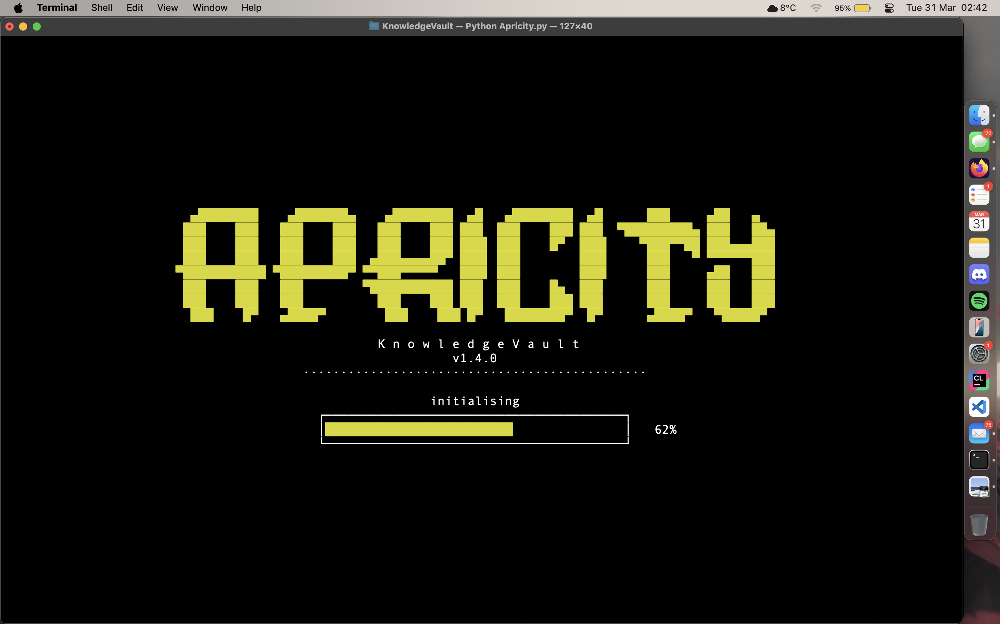
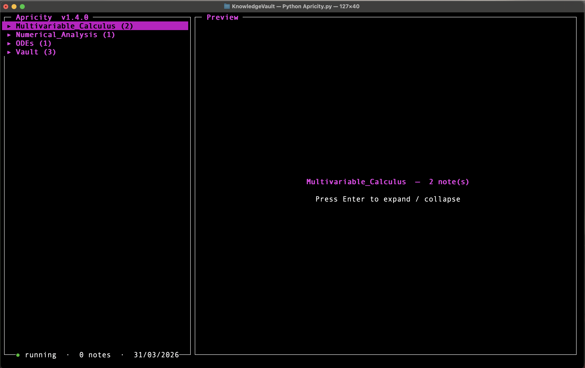
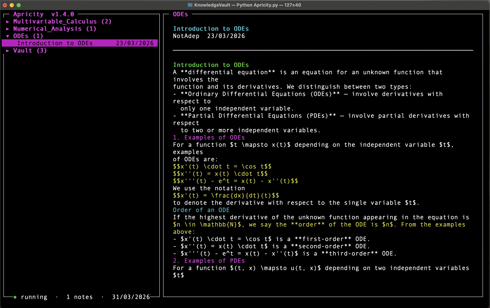
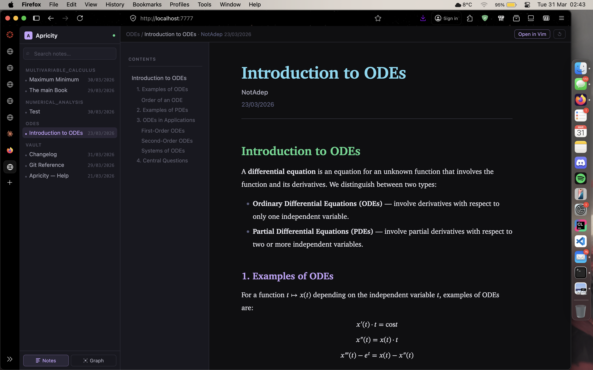
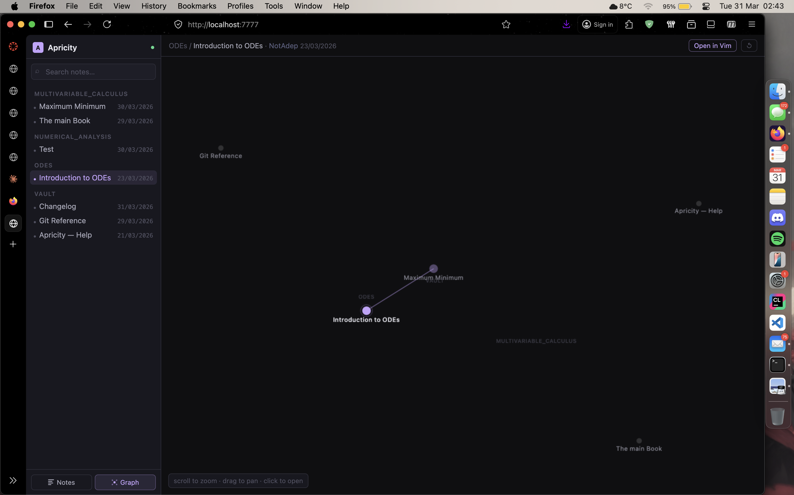

# Apricity

> *apricity (n.)* — the warmth of the sun in winter.

A private, offline, self-hosted knowledge system built around
**Vim + Markdown + Pandoc + LaTeX**. Apricity adds a browser viewer and a
terminal TUI on top of your existing plain-text workflow — without
changing anything about how you write.

> **Actively developed.** Apricity is a personal project in active development.
> Features are added regularly and feedback is very welcome.

---

## What it looks like

After running `python3 Apricity.py` in terminal, you will see the splash screen:



After loading, you arrive at the home page — your vault organised by subject:



Navigate with `j` and `k`. Selecting a note previews it instantly in the right panel:



Press `Enter` to open and edit the note in Vim:


Press `b` anywhere to open the browser viewer with full math rendering:



Link notes using `[[WikiLinks]]` and the graph view shows real connections:



---

## Two interfaces, one vault

- **Terminal TUI** — navigate, search, create, delete, and open notes
  without leaving the keyboard
- **Browser viewer** — read notes with full math rendering, a real graph
  view of connections, and live reload when you save in Vim

---

## Philosophy

- **Plain text forever** — every note is a `.md` file. No databases,
  no proprietary formats, no lock-in. Your notes will be readable in
  any text editor for the rest of your life
- **Your workflow, unchanged** — write in Vim, compile with Pandoc,
  view in the browser. Apricity wraps around what you already do
  rather than replacing it
- **Fully offline** — no cloud, no telemetry, no accounts. Everything
  runs on your own machine
- **Zero dependencies** — Python 3 stdlib only. No `pip install`,
  no virtual environments, no package managers

---

## Requirements

- macOS (tested on Apple M4). Linux and Windows support is planned
- Python 3.9+
- [Pandoc](https://pandoc.org/installing.html)
- A text editor — [Vim](https://www.vim.org/) or [NeoVim](https://neovim.io/) recommended
- Any modern browser (Safari, Firefox, Chrome)
- For PDF export: a LaTeX engine — [BasicTeX](https://www.tug.org/mactex/morepackages.html)
  is the lightest option on macOS

---

## Installation

```bash
git clone https://github.com/NotAdep/Apricity.git
cd Apricity
```

Open `vault.py` and point it at your notes folder:

```python
VAULT = Path.home() / "KnowledgeVault"  # change this to your notes folder
```

That is it. No virtual environments, no package managers, no setup scripts.

> **New to this?** See the [Setup Guide](#setup-guide) below for a
> step-by-step walkthrough including Pandoc and Vim installation.

---

## Usage

### Start everything

```bash
python3 Apricity.py
```

The splash screen plays, the server starts silently in the background,
and the TUI loads. Open `http://localhost:7777` in your browser for the
full viewer. Press `q` to quit — the server stops automatically.

You can also run the server on its own:

```bash
python3 vault.py
```

### TUI controls

| Key | Action |
|-----|--------|
| `j` / `↓` | Move down |
| `k` / `↑` | Move up |
| `Enter` | Expand/collapse folder · Open note in Vim |
| `n` | New note in current subject (pre-fills frontmatter) |
| `d` | Delete note or folder — asks for confirmation |
| `o` | Open selected note in browser |
| `b` | Open full vault in browser |
| `l` | Link picker — jump to a linked note across any subject |
| `p` | Open a PDF linked in the current note |
| `Ctrl+D` | Scroll preview down |
| `Ctrl+U` | Scroll preview up |
| `/` | Full-text search across all note contents |
| `Esc` | Clear search |
| `r` | Refresh vault |
| `q` | Quit and stop server |

### Vim shortcuts

Add these to your `~/.vimrc`:

```vim
let mapleader = ","
nnoremap <leader>c :w<CR>:!pandoc "%" -s --mathml --toc -c ../style.css --lua-filter=$HOME/KnowledgeVault/wikilinks.lua -o "%:r.html"<CR>
nnoremap <leader>p :w<CR>:!pandoc "%" --pdf-engine=xelatex -o "%:r.pdf"<CR>
```

- `,c` — compile current note to HTML. Wikilinks resolved, browser auto-reloads
- `,p` — export current note to a PDF with fully rendered math

### Vault structure

Apricity expects one level of subject folders inside your vault:

```
~/KnowledgeVault/
  Apricity.py
  vault.py
  notes-viewer.html
  style.css
  wikilinks.lua
  Mathematics/
    Calculus.md
    Calculus.html
  Physics/
    NewtonLaws.md
    NewtonLaws.html
```

Each subject is a folder. Notes go inside. That is it.

### Writing notes

Every note starts with YAML frontmatter:

```markdown
---
title: Lagrange Interpolation
author: Your Name
date: 31/03/2026
---

# Lagrange Interpolation

Use $inline math$ and display math:

$$L_i(x) = \prod_{j=0, j \neq i}^{n} \frac{x - x_j}{x_i - x_j}$$

Link to a note in the same subject: [Matrix Product](Matrix_product.html)

Link to a note in any subject using wikilinks: [[Newton's Laws]]

Wikilink with custom display text: [[Newton's Laws|see also]]

Attach a PDF: [Lecture Slides](slides.pdf)
```

Compile with `,c`. Wikilinks are resolved automatically and the browser reloads.

---

## Features

- **Wikilinks** — use `[[Note Title]]` to link any note from any subject.
  Resolved at compile time by the included Lua filter
- **Real graph view** — the browser graph shows actual connections between
  notes based on wikilinks and markdown links, not just subject groupings
- **Full-text search** — searches inside every `.md` file across all subjects,
  not just titles. Shows matching excerpts in results
- **Auto-reload** — browser updates automatically the moment you press `,c`
- **Cross-subject link navigation** — press `l` in the TUI to jump to any
  linked note regardless of which subject it is in
- **PDF support** — link PDFs in notes and open them with `p` in the TUI,
  or click the link in the browser viewer
- **PDF export** — share any note as a self-contained PDF with rendered math
- **New note from TUI** — press `n` and type a name. Vim opens with
  frontmatter already filled in
- **Collapsible folders** — keep the TUI clean as your vault grows
- **UK date format** — DD/MM/YYYY parsed from YAML frontmatter
- **Server lifecycle** — one command starts everything, `q` stops everything

---

## Customisation

All styling lives in `style.css`. The colour scheme is Dracula-inspired
with Charter as the body font — both are system fonts on macOS, no
downloads needed.

To change the vault path, edit `vault.py`:

```python
VAULT = Path("/path/to/your/notes")
```

The server runs on port `7777` by default. To change it:

```python
PORT = 7777
```

---

## Setup Guide

For users who are new to Vim and Pandoc:

### 1. Install Pandoc

Download the macOS installer directly from
[pandoc.org/installing.html](https://pandoc.org/installing.html).
Run the `.pkg` file. That is it.

Verify:
```bash
pandoc --version
```

### 2. Install Vim

Vim comes pre-installed on macOS. Verify:
```bash
vim --version
```

If you prefer NeoVim, download it from [neovim.io](https://neovim.io).

### 3. Add Vim shortcuts

```bash
vim ~/.vimrc
```

Paste:
```vim
let mapleader = ","
nnoremap <leader>c :w<CR>:!pandoc "%" -s --mathml --toc -c ../style.css --lua-filter=$HOME/KnowledgeVault/wikilinks.lua -o "%:r.html"<CR>
nnoremap <leader>p :w<CR>:!pandoc "%" --pdf-engine=xelatex -o "%:r.pdf"<CR>
```

Save with `:wq`.

### 4. Create your vault

```bash
mkdir -p ~/KnowledgeVault/Mathematics
```

### 5. Clone and configure Apricity

```bash
git clone https://github.com/NotAdep/Apricity.git ~/KnowledgeVault
cd ~/KnowledgeVault
```

Open `vault.py` in any text editor and confirm the vault path is correct.

### 6. Run it

```bash
python3 Apricity.py
```

Open `http://localhost:7777` in your browser. You are ready.

---

## Roadmap

Apricity is actively being developed. Planned for upcoming versions:

- **Linux and Windows support**
- **Backlinks** — see which notes link to the current one
- **Tags filtering** — filter notes by tag in both TUI and browser
- **Export subject as PDF** — compile an entire subject into one document
- **Tauri app** — a proper native `.app` for macOS with one-click install

---

## Feedback and Contributing

Feedback, bug reports, and ideas are very welcome.

- **Found a bug?** Open an [Issue](https://github.com/NotAdep/Apricity/issues)
- **Have an idea?** Open an [Issue](https://github.com/NotAdep/Apricity/issues)
  and label it as a feature request
- **Want to contribute?** Fork the repo, make your changes, and open a
  Pull Request. There are no strict contribution guidelines yet — just
  keep the zero-dependency philosophy in mind

This is a solo project built for real academic use. If you are a student,
researcher, or anyone who takes notes seriously and already uses Vim and
Pandoc, Apricity was built for you.

---

## Changelog

See [CHANGELOG.md](CHANGELOG.md) for the full version history.

Current version: **v1.4.0**

---

## License

MIT License — Copyright (c) 2026 NotAdep

See [LICENSE](LICENSE) for the full text.

---

*Built in a single afternoon. Designed to last a lifetime.*
